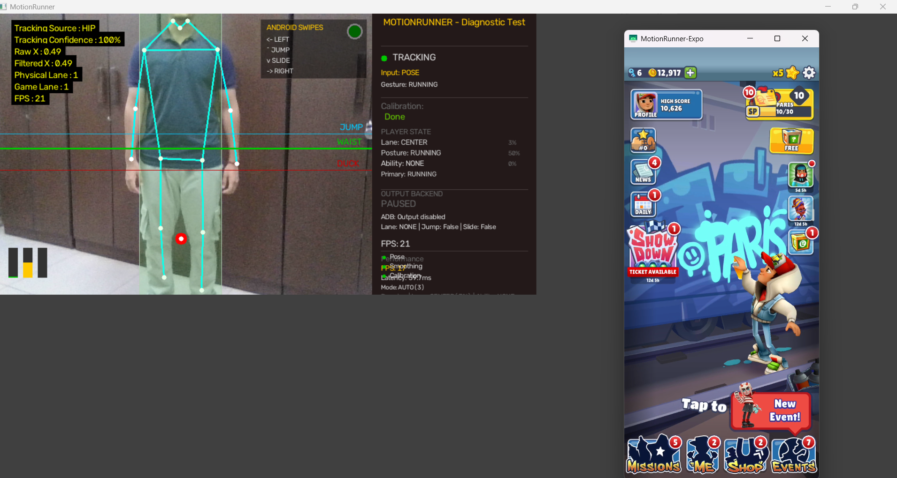
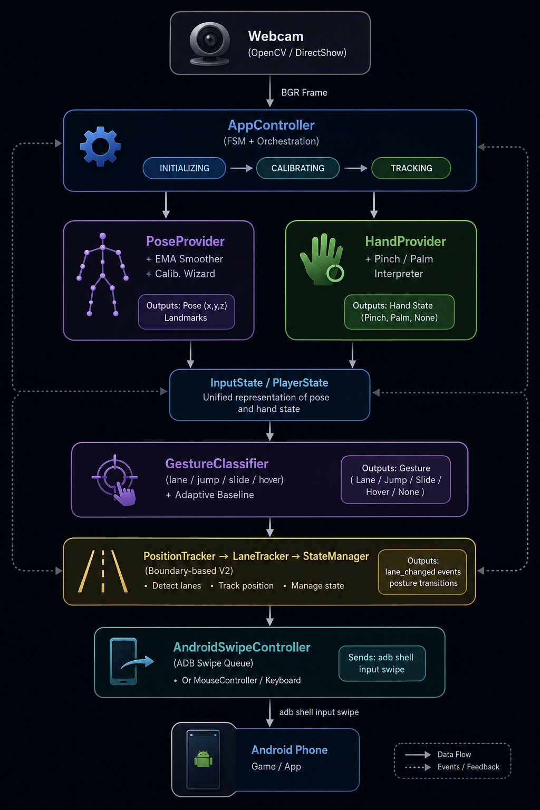
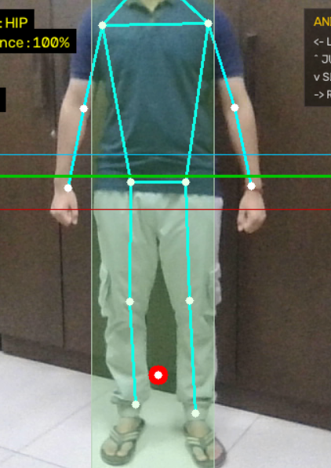

# MotionRunner

### A Vision-Based Webcam Controller for Endless Runner Games

**Computer Vision & Human-Computer Interaction Project Report**

> MotionRunner turns a consumer-grade webcam into a full-body or hand-tracked
> game controller. Using MediaPipe pose/hand landmark estimation, it translates
> the player's physical movements into native Android touch gestures (via ADB)
> that drive endless runners such as *Subway Surfers* — no gamepad, no phone
> gyro, no custom hardware.

---

## Table of Contents

1. [Abstract](#1-abstract)
2. [Introduction](#2-introduction)
   - 2.1 [Problem Statement](#21-problem-statement)
   - 2.2 [Motivation](#22-motivation)
   - 2.3 [Project Goals](#23-project-goals)
3. [System Overview](#3-system-overview)
   - 3.1 [High-Level Architecture](#31-high-level-architecture)
   - 3.2 [Data Flow Pipeline](#32-data-flow-pipeline)
4. [Hardware & Software Requirements](#4-hardware--software-requirements)
5. [Installation & Setup](#5-installation--setup)
6. [Project Structure](#6-project-structure)
7. [Module Deep-Dives](#7-module-deep-dives)
   - 7.1 [Camera Layer](#71-camera-layer)
   - 7.2 [Vision Pipeline](#72-vision-pipeline)
   - 7.3 [Controller Layer](#73-controller-layer)
   - 7.4 [Input Abstraction Layer](#74-input-abstraction-layer)
   - 7.5 [User Interface Layer](#75-user-interface-layer)
   - 7.6 [Utility Layer](#76-utility-layer)
8. [Calibration Methodology](#8-calibration-methodology)
9. [Input Modes](#9-input-modes)
10. [Output Backends](#10-output-backends)
11. [Performance Engineering](#11-performance-engineering)
12. [Diagnostics & Logging](#12-diagnostics--logging)
13. [Configuration & Persistence](#13-configuration--persistence)
14. [Runtime Controls Reference](#14-runtime-controls-reference)
15. [Testing](#15-testing)
16. [Results & Demonstration](#16-results--demonstration)
17. [Limitations & Future Work](#17-limitations--future-work)
18. [Milestones](#18-milestones)
19. [Development](#19-development)
20. [Dependencies](#20-dependencies)
21. [Appendices](#21-appendices)

---

## 1. Abstract

MotionRunner is a real-time, vision-based human-computer interaction system that
maps full-body pose motion (or single-hand gestures) captured from a standard
webcam into native Android touch gestures. The system is built on top of
Google's MediaPipe Pose and Hands solutions and uses the Android Debug Bridge
(ADB) to inject `input swipe` commands directly into a connected phone, allowing
the player to control games such as *Subway Surfers* purely through body
movement.

A central design innovation is **body-relative calibration**: rather than
hardcoding pixel thresholds, a multi-step Calibration Wizard records the player's
own shoulder width, body height, arm length, resting hip height, and left/center/
right body positions. Every detection threshold is then expressed as a *ratio*
of the player's own body — making the system robust across players of differing
height, build, and distance from the camera.

The system additionally features **boundary-based virtual lane tracking** with
hysteresis, an **adaptive baseline** that drifts with player stance over long
sessions, an **adaptive inference scheduler** that dynamically skips frames to
hold a target frame rate, a **diagnostic CSV logger** for tuning, and a hybrid
**sidebar + overlay UI** rendered with OpenCV. The architecture is
provider-pluggable (Pose, Hand, or Keyboard), output-pluggable (ADB swipes,
mouse, or keyboard), and ships with a unit-test suite covering the action
executor, hand provider, input adapters, performance pipeline, Android swipe
controller, mouse controller, and scrcpy window locator.

> 📷 **[Image Placeholder — System Overview Banner]**
> 
> Suggested capture: a single composite image showing the player in front of
> the webcam (left), the MotionRunner UI on the laptop screen (center), and the
> phone running Subway Surfers via scrcpy (right).

---

## 2. Introduction

### 2.1 Problem Statement

Endless runner games such as *Subway Surfers*, *Temple Run*, and *Chrome Dino*
are designed for touch input — swipes and taps on a phone screen. Players with
mobility impairments, players who want a more physical/exergaming experience,
or demo/exhibition settings (classrooms, science fairs) often cannot or do not
want to hold a phone and tap. Off-the-shelf alternatives (gamepads, gyro)
require extra hardware and do not provide full-body engagement.

### 2.2 Motivation

MotionRunner was built to answer a single question: *can a regular webcam and
open-source computer vision libraries replace a game controller for a fast,
real-time game?* The project explores whether real-time pose estimation is fast
and reliable enough to drive sub-100 ms gesture detection, and whether the
resulting system can be calibrated to a specific player's body without code
changes.

### 2.3 Project Goals

1. **Real-time pose → game input**: sub-100 ms gesture detection end-to-end.
2. **Player-portable calibration**: works for any body type, height, or camera
   distance — no recompilation.
3. **Pluggable input/output**: swap pose tracking for hand tracking, or ADB
   swipes for keyboard, without touching the core pipeline.
4. **Observable**: live HUD, performance overlay, and CSV diagnostics so
   behavior is debuggable, not magic.
5. **Demo-ready**: a one-command launcher (`start_expo.bat`) that mirrors the
   phone via scrcpy and starts the controller.

---

## 3. System Overview

### 3.1 High-Level Architecture

```
                          ┌─────────────┐
                          │   Webcam    │   (OpenCV / DirectShow)
                          └──────┬──────┘
                                 │ BGR frame
                                 ▼
            ┌────────────────────────────────────────┐
            │              AppController              │   (FSM + orchestration)
            │  INITIALIZING → CALIBRATING → TRACKING │
            └──────┬─────────────────────────┬───────┘
                   │                         │
                   ▼                         ▼
        ┌────────────────────┐    ┌────────────────────┐
        │   PoseProvider     │    │   HandProvider     │   (MediaPipe inference)
        │  + EMA Smoother    │    │  + Pinch/Palm      │
        │  + Calib. Wizard    │    │    Interpreter      │
        └─────────┬──────────┘    └─────────┬──────────┘
                  │                         │
                  └────────────┬────────────┘
                               │ InputState / PlayerState
                               ▼
                  ┌──────────────────────────┐
                  │   GestureClassifier      │   (lane / jump / slide / hover)
                  │   + Adaptive Baseline    │
                  └────────────┬─────────────┘
                               │ PlayerState
                               ▼
              ┌────────────────────────────────┐
              │  PositionTracker → LaneTracker │   (boundary-based V2)
              │  → StateManager                │
              └────────────┬───────────────────┘
                           │ lane_changed events + posture transitions
                           ▼
            ┌─────────────────────────────────────────┐
            │       AndroidSwipeController            │   (ADB swipe queue)
            │       (or MouseController / Keyboard)  │
            └────────────────────┬────────────────────┘
                                 │ adb shell input swipe
                                 ▼
                          ┌─────────────┐
                          │  Android    │
                          │   Phone     │
                          └─────────────┘
```

> 📷 **[Image Placeholder — Architecture Diagram]**
> 
> Suggested capture: render the ASCII block above as a polished block diagram
> (e.g. in draw.io / Mermaid), showing each stage with its file location.

### 3.2 Data Flow Pipeline

Each iteration of the main loop in `main.py` performs the following stages,
each timed by `LoopTimer` and `RollingProfiler`:

| Stage | Component | Output | Measured As |
|---|---|---|---|
| 1. Capture | `Webcam.read()` | BGR frame | `capture_ms` |
| 2. Preprocess | `PoseTracker.prepare_input()` | Resized RGB frame | `preprocess_ms` |
| 3. Inference | `PoseTracker.detect_rgb()` / `HandProvider._hands.process()` | `PoseFrame` / `HandObservation` | `inference_ms` |
| 4. Classify | `GestureClassifier.classify()` + `LaneTracker.track()` | `PlayerState` + `MotionEvent` | `classify_ms` |
| 5. Android | `AndroidSwipeController.update()` + `dispatch_lane_change()` | ADB swipe queue submissions | (within `update → android` mark) |
| 6. Visualize | `Visualizer.draw()` | Composite BGR canvas | `visualize_ms` |
| 7. Display | `cv2.imshow()` + `cv2.waitKeyEx()` | On-screen window | `display_ms` |

The `InferenceScheduler` may skip stages 2–3 on any given frame (reusing the
last smoothed pose) to hold a target frame rate; skipped frames have
`inference_ms = 0` and `frame_source = "REUSED"`.

> 📷 **[Image Placeholder — Pipeline Timing Diagram]**
> 
> Suggested capture: a horizontal waterfall chart showing the seven stages of
> one frame, with the per-stage `*_ms` timings annotated. Capture from the
> performance overlay (`P` key) or render from a diagnostic CSV.

---

## 4. Hardware & Software Requirements

### 4.1 Hardware

| Hardware | Why It Is Needed |
|---|---|
| **Webcam** (720p or better) | Captures the player for pose or hand tracking |
| **Android phone** with the target game installed | Runs *Subway Surfers* or another endless runner |
| **USB cable** | Connects the phone to the laptop for ADB |
| **Laptop / PC** (Windows recommended) | Runs MotionRunner and scrcpy |
| **Projector / external display** (optional) | For exhibition / classroom demos |

### 4.2 Software

| Software | Why It Is Needed |
|---|---|
| **Python 3.8–3.12** | Runs MotionRunner; required by the pinned MediaPipe package |
| **Git** | Clones the repository |
| **Android Studio** | Provides Android SDK management and USB driver tooling |
| **Android SDK Platform-Tools** | Provides `adb.exe`, which sends touchscreen swipes to the phone |
| **scrcpy** | Mirrors the phone screen on the laptop/projector for the demo |
| **USB driver for the phone** | Lets Windows detect the Android device over ADB |

### 4.3 Python Dependencies (`requirements.txt`)

| Package | Version | Purpose |
|---|---|---|
| `mediapipe` | `==0.10.9` | Pose + hand landmark estimation |
| `opencv-python` | `>=4.8.0` | Camera capture + rendering |
| `numpy` | `>=1.24.0` | Array operations for overlays |
| `pynput` | `>=1.7.0` | Legacy keyboard and mouse backend support |

`winsound` (calibration audio cues) is part of the Python standard library on
Windows and requires no installation.

---

## 5. Installation & Setup

### 5.1 Quick Start

```powershell
# 1. Create and activate a virtual environment
python -m venv .venv
.\.venv\Scripts\Activate.ps1

# 2. Install Python dependencies
pip install -r requirements.txt

# 3. Verify Android device access
adb devices

# 4. Run the expo build
.\start_expo.bat
```

> **Python:** 3.8–3.12 is required by MediaPipe. A webcam and exactly one
> authorized Android device are required for the expo Android-swipe backend.

`start_expo.bat` starts `scrcpy` for phone viewing and then launches
`python main.py`. `scrcpy` is optional for input; the game controls are sent
directly to Android through `adb shell input swipe`.

### 5.2 Android Studio / ADB Setup

1. Install Android Studio.
2. Open Android Studio, then install **Android SDK Platform-Tools** from the
   SDK Manager.
3. Add Platform-Tools to your Windows `Path`. Common location:

   ```text
   C:\Users\<you>\AppData\Local\Android\Sdk\platform-tools
   ```

4. On the phone, enable **Developer options** and **USB debugging**.
5. Connect the phone by USB and accept the RSA authorization prompt.
6. Verify that exactly one authorized device is connected:

   ```powershell
   adb devices
   ```

   Expected output:

   ```text
   List of devices attached
   R9ZYA01CHJA     device
   ```

If the device says `unauthorized`, unlock the phone and accept the USB debugging
prompt. If zero or multiple devices are listed, MotionRunner will pause Android
output and send no gestures (`AndroidSwipeController._discover_device()` rejects
any state other than exactly one authorized device).

> 📷 **[Image Placeholder — ADB Authorization Prompt]**
> 
> Suggested capture: screenshot of the phone's USB-debugging RSA fingerprint
> dialog, plus the terminal output of `adb devices` showing a single device.

### 5.3 scrcpy Setup

Install scrcpy and make sure `scrcpy.exe` is on your Windows `Path`:

```powershell
scrcpy --version
```

If `scrcpy` is installed in a folder such as
`C:\scrcpy\scrcpy-win64-v4.1\scrcpy-win64-v4.1`, add that folder to `Path`.
For a one-terminal temporary setup:

```powershell
$env:Path = "C:\scrcpy\scrcpy-win64-v4.1\scrcpy-win64-v4.1;$env:Path"
```

You should also be able to run:

```powershell
scrcpy
```

> 📷 **[Image Placeholder — scrcpy Window]**
> 
> Suggested capture: the scrcpy window mirroring Subway Surfers on the laptop
> screen, with the window title `MotionRunner-Expo` visible.

### 5.4 First-Run Calibration

On launch, MotionRunner looks for a saved calibration profile under
`~/.motionrunner/profiles/default.json`. If found, you can press **Enter** to
reuse it or **R** to recalibrate. In pose mode a multi-step **Calibration
Wizard** guides you through standing still, then leaning left and right to
record lane positions. Once calibration completes, every threshold is expressed
as a *ratio of your own body* — not hardcoded pixels — so it works for kids,
adults, tall, and short players alike.

The camera feed is mirrored by default so the preview feels like a mirror and
left/right gestures line up with what you expect.

**Press Q to quit.**

---

## 6. Project Structure

```
MotionRunner/
│
├── main.py                              # Entry point + main loop + key handling
├── requirements.txt                     # Pinned Python dependencies
├── start_expo.bat                       # Windows launcher: scrcpy + python main.py
├── .gitignore
├── README.md                            # This document
│
├── camera/
│   ├── __init__.py
│   └── webcam.py                        # Webcam wrapper (index, resolution, mirror, DirectShow)
│
├── vision/
│   ├── __init__.py
│   ├── landmarks.py                     # Landmark dataclass + angle_between() helper
│   ├── pose_frame.py                     # PoseFrame with cached derived properties
│   ├── pose_tracker.py                   # MediaPipe Pose -> PoseFrame
│   ├── pose_smoother.py                  # EMA filter (LandmarkFilter ABC)
│   ├── pose_provider.py                  # Pose pipeline: tracker + smoother + wizard + classifier
│   └── hand_provider.py                 # Hand pipeline: MediaPipe Hands + pinch/palm interpreter
│
├── controller/
│   ├── __init__.py
│   ├── action.py                         # PlayerState, Lane/Posture/Ability enums, detector result types
│   ├── calibration.py                    # Calibrator: median-over-N-frames body calibration
│   ├── calibration_wizard.py             # Multi-step wizard flow with audio cues + quality check
│   ├── action_executor.py                # PlayerState transitions -> KeyboardEvent queue
│   ├── android_swipe_controller.py       # PlayerState/lane events -> ADB swipes (threaded worker)
│   ├── mouse_controller.py               # PlayerState -> Windows cursor via pynput (legacy)
│   ├── scrcpy_window.py                  # Win32 FindWindow lookup of scrcpy client rect
│   ├── keyboard_controller.py            # KeyboardEvent dispatch + held-key cleanup (legacy)
│   ├── keyboard_events.py                # KeyboardEvent + KeyEventType definitions
│   ├── app_controller.py                 # Runtime FSM + provider orchestration
│   ├── position_tracker.py               # Best-landmark selection (hip → shoulder → nose)
│   ├── lane_tracker.py                   # Boundary-based lane classification + hysteresis
│   ├── state_manager.py                  # Physical lane → game lane event resolution
│   ├── motion_event.py                   # TrackingResult + MotionEvent dataclasses
│   │
│   └── gestures/
│       ├── __init__.py
│       ├── gesture_classifier.py         # Orchestrates 4 detectors + adaptive baseline → PlayerState
│       ├── lane_detector.py              # Body-center delta relative to shoulder width
│       ├── jump_detector.py              # Hip Y velocity + confirmation window + cooldown
│       ├── slide_detector.py             # Hip Y + knee angle + body compression FSM
│       └── hoverboard_detector.py        # Both wrists above nose held for 500 ms
│
├── input/
│   ├── __init__.py
│   ├── input_state.py                    # Provider-normalized InputState dataclass
│   ├── provider.py                       # InputProvider ABC + ProviderPerfStats
│   ├── adapters.py                       # PlayerState <-> InputState converters
│   └── keyboard_provider.py              # Synthetic keyboard-driven provider (testing fallback)
│
├── ui/
│   ├── __init__.py
│   ├── visualizer.py                     # Hybrid layout (feed + sidebar overlay) + wizard overlay
│   ├── hud.py                            # Gesture flash, tracking-quality dot, confidence meters, timeline
│   ├── lane_overlay.py                   # Virtual lane boundaries + tracking-source debug panel
│   ├── perf_overlay.py                   # Per-stage timing graph + stage-color bar
│   └── theme.py                          # Theme + GuideTheme dataclasses (BGR color constants)
│
├── utils/
│   ├── __init__.py
│   ├── config.py                         # AppConfig: single source of truth for all thresholds
│   ├── cooldown.py                       # CooldownManager: per-action cooldown timers
│   ├── performance.py                    # LoopTimer, RollingProfiler, InferenceScheduler
│   └── diagnostic.py                     # DiagnosticLogger: per-frame CSV + JSON summary writer
│
├── presets/                              # Tunable parameter sets (cycle with [ / ])
│   ├── default.json                      # "Normal"
│   ├── sensitive.json                    # "Sensitive"
│   ├── stable.json                       # "Stable"
│   └── diagnostic_test.json              # "Diagnostic Test" (extreme parameters)
│
├── debug/
│   └── __init__.py                       # Pose logger hooks (placeholder for future)
│
└── tests/
    ├── test_action_executor.py           # ActionExecutor transition → KeyboardEvent tests
    ├── test_android_swipe_controller.py  # ADB discovery + ordered swipe + cooldown tests
    ├── test_hand_provider.py             # HandGestureInterpreter + HandCalibrationData tests
    ├── test_input_adapters.py            # PlayerState ↔ InputState round-trip test
    ├── test_mouse_controller.py          # MouseController movement + bounds clamping tests
    ├── test_performance_pipeline.py      # InferenceScheduler + PoseTracker + CalibrationData tests
    └── test_scrcpy_window.py             # ScrcpyWindow Win32 lookup + throttle tests
```

> 📷 **[Image Placeholder — Repository Tree Screenshot]**
> 
> Suggested capture: a screenshot of the project open in VS Code's Explorer
> pane, with all directories expanded so the file layout is visible.

---

## 7. Module Deep-Dives

### 7.1 Camera Layer

#### `camera/webcam.py` — `Webcam`

A thin wrapper around `cv2.VideoCapture` that:

- Forces the **DirectShow** backend on Windows (`cv2.CAP_DSHOW`) to bypass the
  multi-frame Media Foundation queue, which otherwise makes the live control
  loop feel sluggish even when measured FPS is acceptable.
- Sets `CAP_PROP_BUFFERSIZE = 1` to minimize frame backlog.
- Sets `CAP_PROP_AUTO_EXPOSURE = 0.75` (auto-exposure priority) so the camera
  adjusts brightness without freezing on motion.
- Mirrors the frame horizontally (`cv2.flip(frame, 1)`) when
  `config.mirror_camera` is `True` (default), so the preview feels like a mirror.
- Prints camera backend, resolution, exposure, brightness, contrast, and gain
  to stdout on init for diagnostic purposes.
- Measures per-frame capture latency in `last_capture_ms` (note: scaled by
  `350.0` to map OpenCV latency into a perceptually-useful range for the HUD).

| Public API | Returns | Notes |
|---|---|---|
| `__init__(config)` | — | Raises `RuntimeError` if camera cannot be opened or returns no frames |
| `read()` | `np.ndarray` (BGR frame) | Raises `RuntimeError` on read failure |
| `release()` | `None` | Releases the `VideoCapture` |

### 7.2 Vision Pipeline

The vision layer turns raw BGR frames into a normalized `InputState`. It hosts
two parallel providers — `PoseProvider` (full-body) and `HandProvider`
(single-hand) — each implementing the `InputProvider` ABC from `input/provider.py`.

#### `vision/landmarks.py` — `Landmark` + `angle_between()`

- `Landmark` is a frozen dataclass with `x`, `y`, `z`, `visibility` fields.
- Provides `distance_to()`, `midpoint()`, `to_tuple()`, `__add__`, `__truediv__`.
- `angle_between(a, b, c)` returns the angle (in degrees) at vertex `b` between
  vectors `ba` and `bc` — used by `SlideDetector` for knee-angle computation.

#### `vision/pose_frame.py` — `PoseFrame`

A dataclass holding all 15 tracked landmarks (nose, eyes, shoulders, elbows,
wrists, hips, knees, ankles) plus `timestamp`, `frame_index`, `fps`.

Cached derived properties:

| Property | Definition |
|---|---|
| `hip_center` | Midpoint of left + right hip |
| `shoulder_center` | Midpoint of left + right shoulder |
| `body_center` | Midpoint of `shoulder_center` and `hip_center` |
| `shoulder_width` | Distance from left shoulder to right shoulder |
| `body_height` | Distance from nose to `hip_center` |
| `left_knee_angle` / `right_knee_angle` | Angle at the knee (hip-knee-ankle) |
| `min_knee_angle` | `min(left_knee_angle, right_knee_angle)` |

#### `vision/pose_tracker.py` — `PoseTracker`

Wraps MediaPipe's legacy `mp.solutions.pose.Pose` solution:

- Configurable `model_complexity`, `min_detection_confidence`,
  `min_tracking_confidence`.
- `prepare_input(frame)` resizes the frame to `processing_width ×
  processing_height` (if non-zero) and converts BGR → RGB.
- `detect_rgb(rgb)` runs `self._pose.process(rgb)`, then maps MediaPipe's
  `PoseLandmark` enum values to a `PoseFrame`.
- Maintains an EMA-smoothed `_fps` counter (`0.9 * old + 0.1 / dt`).
- `reuse(pose, timestamp)` returns a new `PoseFrame` with updated
  `timestamp` / `frame_index` / `fps` for skipped inference frames — without
  re-running MediaPipe.

#### `vision/pose_smoother.py` — `EMAFilter(LandmarkFilter)`

- `LandmarkFilter` is an ABC with a single `update(frame) -> PoseFrame | None`
  method — designed to be swapped (e.g. for a future One-Euro filter).
- `EMAFilter(alpha)` applies exponential moving average to every landmark
  coordinate independently: `smoothed = alpha * current + (1 - alpha) * prev`.
- Resets when `None` is passed (i.e. pose lost).

#### `vision/pose_provider.py` — `PoseProvider(InputProvider)`

The full pose pipeline in one class. Owns:

- `PoseTracker` (MediaPipe inference)
- `EMAFilter` (smoothing, alpha = `config.smoothing_alpha`)
- `CalibrationWizard` (if `config.calibration_wizard_enabled`)
- `GestureClassifier` (4 gesture detectors + adaptive baseline)
- `InferenceScheduler` (decides whether to run inference this frame)

`update(frame) -> InputState` does, per frame:

1. Ask `InferenceScheduler.should_process()` whether to run inference.
2. If yes: preprocess → `tracker.detect_rgb(rgb)` → `smoother.update(raw)`
   → record `inference_ms` in scheduler.
3. If no: reuse last smoothed pose with fresh timestamp.
4. If wizard is active, drive the wizard state machine with the latest pose.
5. If calibrator is active, drive calibration collection.
6. Otherwise, call `classifier.classify(pose)` to produce a `PlayerState`,
   then `player_state_to_input_state()` to normalize it.
7. Update `perf_stats` (preprocess_ms, inference_ms, classify_ms,
   processed_frame, processing_mode, auto_switches).

#### `vision/hand_provider.py` — `HandProvider(InputProvider)`

Parallel pipeline for single-hand tracking. Hosts three classes:

- **`HandCalibrationData`** — holds `center_x` (median palm_x over N frames).
- **`HandCalibrator`** — collects `config.hand_calibration_frames` (default 45)
  samples after a `config.calibration_countdown_s` countdown, then takes the
  median palm_x as the calibrated neutral position.
- **`HandGestureInterpreter`** — interprets a `HandObservation` into an
  `InputState`:
  - `open_palm` true → computes offset from calibrated center; if
    `|offset| >= hand_dead_zone` → `Lane.LEFT` or `Lane.RIGHT`.
  - `pinch_active` true → starts a timer; if held for
    `config.hoverboard_hold_ms` (default 500 ms) → activates
    `Ability.HOVERBOARD`.
- **`HandProvider`** — wraps `mp.solutions.hands.Hands` (max 1 hand,
  `min_detection_confidence`, `min_tracking_confidence`). Converts the
  21 hand landmarks into a `HandObservation`:
  - `palm_x` = mean of landmark indices 0, 5, 9, 13, 17 (palm base + finger
    MCPs).
  - `open_palm` = all four non-thumb fingertips are above their PIP joints.
  - `pinch_active` = Euclidean distance between thumb tip (4) and index tip
    (8) is below `config.hand_pinch_threshold` (default 0.06).
  - Also uses the `InferenceScheduler` for adaptive frame skipping.

> 📷 **[Image Placeholder — Pose Skeleton Overlay]**
> 
> Suggested capture: a frame from the live preview showing the 16-landmark
> skeleton (yellow bones, white landmark dots) drawn over the player, with the
> hip-center ring visible.

> 📷 **[Image Placeholder — Hand Landmarks Overlay]**
> 
> Suggested capture: a frame from the live preview in `InputMode.HAND`
> showing the 21 hand landmarks as white dots, with the pinch state and palm
> lane label visible in the sidebar.

### 7.3 Controller Layer

The controller layer is the heart of MotionRunner. It owns the runtime state
machine, calibration, gesture detection, lane tracking, and output dispatch.

#### 7.3.1 `controller/app_controller.py` — `AppController`

Central runtime orchestrator. Owns the provider, calibrator, position tracker,
lane tracker, state manager, and gesture classifier. Wires them together in a
single per-frame `update(frame)` method.

**State machine** (`AppState` enum):

```
INITIALIZING → CALIBRATING → TRACKING
                  ▲             │
                  │             ▼
                  └──────── LOST
                              │
                              ▼
                            ERROR
```

- `INITIALIZING` — provider has not yet produced a valid pose.
- `CALIBRATING` — wizard / calibrator is collecting frames.
- `TRACKING` — fully calibrated; producing `PlayerState` + `MotionEvent`s.
- `LOST` — `last_input.tracking` has been `False` for ≥
  `config.lost_frame_threshold` consecutive frames; recovery re-enters
  `CALIBRATING` automatically.
- `ERROR` — unrecoverable; `error_msg` is set.

**Public API:**

| Method / Property | Description |
|---|---|
| `update(frame)` | Drives one frame through the entire pipeline |
| `inject_calibration(cal_data)` | Preloads a saved calibration, bypassing the wizard |
| `state` | Current `AppState` |
| `pose` | Latest `PoseFrame` (or `None`) |
| `last_result` | Latest `PlayerState` (or `None`) |
| `last_input` | Latest `InputState` (or `None`) |
| `events_this_frame` | List of `(previous_game_lane, desired_game_lane)` tuples |
| `wizard` | The active `CalibrationWizard` (or `None`) |
| `calibrator` | The active `Calibrator` |
| `provider` | The active `InputProvider` |
| `perf_stats` | Latest `PipelineStats` |
| `latest_tracking_result` | Latest `TrackingResult` from `PositionTracker` |
| `state_manager` | The active `StateManager` |
| `input_mode` | `InputMode.POSE` or `InputMode.HAND` |
| `hand_landmarks` | Tuple of `(x, y)` from the hand provider |
| `error_msg` | Error description when `state == ERROR` |

> 📷 **[Image Placeholder — App State Machine]**
> 
> Suggested capture: a state diagram showing the five `AppState` values and
> the transition conditions (pose found, calibration done, tracking lost,
> error). Render in draw.io or Mermaid `stateDiagram-v2`.

#### 7.3.2 `controller/calibration.py` — `Calibrator` + `CalibrationData`

Collects `config.calibration_frames` (default 60) consecutive valid
`PoseFrame`s after a `config.calibration_countdown_s` (default 3 s) countdown,
then computes body-proportional metrics using `statistics.median` over all
collected frames:

| Metric | Definition |
|---|---|
| `shoulder_width` | Distance between left and right shoulder |
| `body_height` | Distance from nose to hip center |
| `arm_length` | Distance from shoulder to wrist (averaged) |
| `rest_hip_y` | Y-coordinate of hip center at rest |
| `body_center_x` | X-coordinate of body center at rest |
| `inverse_shoulder_width` | `1.0 / shoulder_width` (precomputed for fast offset normalization) |
| `jump_line_y` | `rest_hip_y − jump_line_offset × body_height` |
| `effective_jump_line_y` | `jump_line_y − jump_dead_zone × body_height` (hysteresis) |
| `duck_line_y` | `rest_hip_y + duck_line_offset × body_height` |
| `lane_positions` | `[cx − 0.15, cx, cx + 0.15]` (backwards-compat fallback when wizard not used) |

**Quality check** (`CalibrationQuality`):

- `shoulder_width_ok` — `shoulder_width >= calibration_min_shoulder_width`
- `body_height_ok` — `body_height >= calibration_min_body_height`
- `hip_centered` — body_center_x is within `[0.3, 0.7]`

#### 7.3.3 `controller/calibration_wizard.py` — `CalibrationWizard`

A multi-step guided flow that extends the basic `Calibrator` with left/right
lean recording and a preview jump-test. Uses `winsound.MessageBeep` for audio
cues when `config.calibration_audio_enabled` is `True`.

**Wizard states (`WizardState` enum):**

| State | Behavior | Duration / Exit |
|---|---|---|
| `WELCOME` | "Stand in frame, feet shoulder-width apart" | 2 seconds |
| `POSITIONING` | Highlights critical landmarks (shoulders, hips, ankles) green/red until all visible | Stable for `positioning_stable_ms` (default 1000 ms) |
| `COUNTDOWN` | Large countdown number 3 → 2 → 1 with audible beeps | `calibration_countdown_s` (default 3 s) |
| `COLLECTING_CENTER` | Invokes `Calibrator.start()` + `update()` until done; shows progress bar | `calibration_frames` (default 60 frames) |
| `COLLECTING_LEFT` | "LEAN LEFT" — player leans until body_center shifts ≥ 10% screen width; progress bar fills right-to-left | Hold 0.5 s at target |
| `COLLECTING_RIGHT` | "LEAN RIGHT" — same as left but opposite direction; progress bar fills left-to-right | Hold 0.5 s at target |
| `QUALITY_CHECK` | If calibration fails quality check, shows `[OK]`/`[FAIL]` per metric; "Press R to retry" | Until user presses R |
| `PREVIEW` | "Jump now to test!" — shows jump/waist/duck guide lines live; jump line turns cyan when triggered | `calibration_preview_duration_s` (default 3 s) |
| `DONE` | Wizard complete; `calibration_result` is populated | — |

**Public API:**

| Method / Property | Description |
|---|---|
| `update(pose)` | Drives the wizard state machine; returns current `WizardState` |
| `reset()` | Returns to `WELCOME` |
| `retry()` | Re-runs the wizard from `POSITIONING` after a quality-check failure |
| `advance_from_preview()` | Ends `PREVIEW` early on any keypress |
| `calibration_result` | `CalibrationData` or `None` |
| `quality` | `CalibrationQuality` (only set in `QUALITY_CHECK` state) |
| `left_progress` / `right_progress` | `float` in `[0, 1]` for the lean progress bars |
| `preview_jump_detected` | `True` when the player jumps during `PREVIEW` |

> 📷 **[Image Placeholder — Calibration Wizard Flow]**
> 
> Suggested capture: a vertical strip of 6 screenshots showing the live preview
> during each wizard state: WELCOME, POSITIONING (with red/green landmark dots),
> COUNTDOWN (large "3"), COLLECTING_CENTER (progress bar), COLLECTING_LEFT
> (lean-left progress bar), PREVIEW (jump/waist/duck guide lines).

> 📷 **[Image Placeholder — Quality Check Screen]**
> 
> Suggested capture: the `QUALITY_CHECK` overlay showing `[OK] Shoulder width`,
> `[FAIL] Body height`, etc., with the "Press R to retry" prompt.

#### 7.3.4 `controller/lane_tracker.py` — `LaneTracker`

**Boundary-based lane classification (V2).** Instead of finding the nearest
lane center, the tracker computes explicit boundaries between adjacent lane
positions and classifies purely by region.

For N lane positions `[p0, p1, ..., pN-1]`, it computes N−1 boundaries:

```
boundary[i] = (positions[i] + positions[i+1]) / 2
```

Classification:

```
x < boundary[0]           → lane 0 (LEFT)
boundary[0] ≤ x < boundary[1]  → lane 1 (CENTER)
x ≥ boundary[N-2]         → lane N-1 (RIGHT)
```

**Hysteresis:** a buffer of `total_span × lane_buffer_percentage / 2` is added
to (or subtracted from) each boundary, depending on which direction the player
is moving. This prevents rapid lane flipping when the player hovers near a
boundary.

**Cooldown:** `lane_change_cooldown_ms` (default 120 ms) suppresses spurious
double-taps. `UNKNOWN` (−1) transitions are always allowed immediately.

#### 7.3.5 `controller/state_manager.py` — `StateManager`

Maps physical lane index (−1, 0, 1, 2) to game lane index. Emits a
`(previous_game_lane, desired_game_lane)` tuple only when the game lane
actually changes.

- Starts at `game_lane = config.lane_count // 2` (center).
- On `lane_changed` event with `current == −1` (tracking lost) → returns `None`
  (no lane change dispatched).
- Otherwise, if `desired ≠ current` → updates `game_lane` and returns the delta.

#### 7.3.6 `controller/position_tracker.py` — `PositionTracker`

Selects the best available tracking landmark for lane classification, with
debouncing:

| Priority | Landmark | Fallback Condition |
|---|---|---|
| 1 | Hip center | Visibility > `lane_lost_confidence_threshold` for < 5 consecutive frames |
| 2 | Shoulder center | Visibility > `lane_lost_confidence_threshold` for < 5 consecutive frames |
| 3 | Nose | Always available as last resort |

- Each landmark tracks a 5-frame loss counter before source switch.
- Explicitly skips double-EMA: the `PoseProvider` already smooths upstream.
- Returns a `TrackingResult(raw_x, filtered_x, tracking_source, confidence,
  timestamp)` where `raw_x == filtered_x`.

#### 7.3.7 `controller/motion_event.py`

Two frozen dataclasses that flow through the tracking pipeline:

- **`TrackingResult`** — output of `PositionTracker`: `raw_x`, `filtered_x`,
  `tracking_source` (str: `"hip"` / `"shoulder"` / `"nose"`), `confidence`,
  `timestamp`.
- **`MotionEvent`** — output of `LaneTracker`: `type` (`"lane_changed"`),
  `previous`, `current`, `confidence`, `timestamp`.

#### 7.3.8 `controller/action.py`

Defines the core state enums and result dataclasses:

- **`Action`** (legacy enum) — `RUNNING`, `LEFT`, `RIGHT`, `JUMP`, `SLIDE`,
  `HOVERBOARD`. Has `.key` (returns `"left"`/`"right"`/`"up"`/`"down"`/
  `"space"`/`None`) and `.hold` (returns `True` only for `SLIDE`).
- **`Lane`** — `LEFT`, `CENTER`, `RIGHT`.
- **`Posture`** — `RUNNING`, `JUMP`, `SLIDE`.
- **`Ability`** — `HOVERBOARD`.
- **`PlayerState`** — the canonical per-frame state: `lane`, `posture`,
  `abilities` (set), `lane_confidence`, `posture_confidence`,
  `ability_confidence`, `timestamp`, `frame_index`, plus optional detector
  results (`lane_result`, `jump_result`, `slide_result`, `hoverboard_result`).
  Exposes `primary_action` for transitional compatibility with the legacy
  `Action` enum.
- **`LaneResult`, `JumpResult`, `SlideResult`, `HoverboardResult`** — detailed
  per-detector diagnostic dataclasses.

#### 7.3.9 `controller/action_executor.py` — `ActionExecutor`

Converts `PlayerState` transitions and `lane_changed` events into ordered
lists of `KeyboardEvent` objects. Transition-driven — events fire only when
state *changes*, not continuously.

| Sub-executor | Behavior |
|---|---|
| `LaneExecutor` | One TAP per lane-step (handles multi-lane sweeps like LEFT → RIGHT) |
| `PostureExecutor` | TAP for JUMP, HOLD for SLIDE entry, RELEASE for SLIDE exit |
| `AbilityExecutor` | One-shot TAP for HOVERBOARD on activation |

`execute_lane(previous, desired)` and `execute_posture_ability(current)`
return `list[KeyboardEvent]`. The `KeyMap` dataclass in `utils/config.py`
binds each `PlayerCommand` to an actual key string.

#### 7.3.10 `controller/keyboard_events.py`

- **`KeyboardEvent`** — frozen dataclass: `timestamp`, `command`
  (`PlayerCommand`), `key` (str), `type` (`KeyEventType`), `reason` (str).
- **`KeyEventType`** — `TAP`, `HOLD`, `RELEASE`.

#### 7.3.11 `controller/keyboard_controller.py` — `KeyboardController` (legacy)

Hardware dispatcher for `KeyboardEvent` objects via `pynput.keyboard.Controller`:

- TAP → press + release immediately.
- HOLD → press and track in `_held_keys` dict.
- RELEASE → looks up key in `_held_keys` and releases it.
- `_history` deque (maxlen=8) for debugging.
- `release_all()` is the emergency-stop path (clears all held keys).

> The keyboard backend is legacy code kept intact for desktop/emulator
> workflows. The expo branch does not instantiate it from `main.py`; Android
> gameplay input comes from `AndroidSwipeController` and ADB swipes.

#### 7.3.12 `controller/mouse_controller.py` — `MouseController` (legacy)

Consumes `PlayerState` directly and moves the Windows cursor via
`pynput.mouse.Controller`. The cursor speed is `config.cursor_speed` (default
400 px/s). Lane deltas move X; posture deltas move Y.

- Bounds-clamped to the scrcpy window rect (queried via `ScrcpyWindow.find()`).
- `pause()` / `resume()` for user toggling.
- `reset_to_center()` snaps cursor to window center.
- Diagonal movement supported (e.g. JUMP + LEFT moves both axes).

#### 7.3.13 `controller/scrcpy_window.py` — `ScrcpyWindow`

Windows-only utility that queries the OS for the on-screen bounds/center of the
scrcpy window. Uses `ctypes` + `user32.FindWindowW(title)`,
`GetClientRect()`, and `ClientToScreen()` to get screen-relative pixel bounds
from the window title (default `"MotionRunner-Expo"`).

- `find() → (left, top, right, bottom) | None`
- `center() → (x, y) | None`
- `is_available` property
- Cached result refreshed at `config.mouse_bounds_refresh_ms` (default 200 ms).

#### 7.3.14 `controller/android_swipe_controller.py` — `AndroidSwipeController`

The expo backend. Sends native Android touch gestures through ADB
(`adb shell input swipe`). Key design:

- **Device discovery** — `_discover_device()` runs `adb devices`, requires
  exactly one authorized device, then reads `wm size` for screen dimensions.
  Falls back to `%LOCALAPPDATA%\Android\Sdk\platform-tools\adb.exe` if `adb`
  is not on `PATH`.
- **Threaded worker** — `_run_worker()` runs on a daemon thread
  (`android-swipe-worker`), pulling `_Swipe` objects from a `queue.Queue`
  (max size 16). This keeps the camera loop responsive.
- **Generation counter** — `clear_pending()` increments `_generation` so any
  in-flight stale swipes are discarded by the worker.
- **Swipe targets** (computed from screen size):

| Direction | Start | End | Game Action |
|---|---|---|---|
| `left` | `(50%, 50%)` | `(30%, 50%)` | Move left one lane |
| `right` | `(50%, 50%)` | `(70%, 50%)` | Move right one lane |
| `up` | `(50%, 50%)` | `(50%, 35%)` | Jump |
| `down` | `(50%, 50%)` | `(50%, 65%)` | Slide / duck |

- **Lane-step dispatch** — `dispatch_lane_change(prev, desired)` submits one
  swipe per lane step (so a LEFT → RIGHT transition submits two right swipes).
- **Cooldown** — `_DUPLICATE_COOLDOWN_S = 0.1` s prevents duplicate gestures of
  the same direction within 100 ms (lane-step swipes bypass this).
- **Posture transitions** — `update(player_state)` submits an `up` swipe when
  posture enters `JUMP`, a `down` swipe when it enters `SLIDE`.

> 📷 **[Image Placeholder — ADB Swipe Map on Phone Screen]**
> 
> Suggested capture: a diagram of a phone screen showing the four swipe
> directions (← → ↑ ↓) as arrows from screen center to the four target points
> (30%, 70%, 35%, 65%). Annotate each arrow with the game action it triggers.

> 📷 **[Image Placeholder — scrcpy + Subway Surfers Live]**
> 
> Suggested capture: the scrcpy window mid-game showing the player's character
> mid-jump, with the MotionRunner preview window visible alongside it on the
> laptop screen.

#### 7.3.15 `controller/gestures/` — Gesture Detectors

Five files implementing the four parallel detectors + the orchestrator.

##### `gestures/gesture_classifier.py` — `GestureClassifier`

Orchestrator that runs all four detectors and resolves conflicts. Resolution
priority: **slide > jump > running** for posture (a slide cancels a jump).

**Adaptive baseline** — when `config.adaptive_baseline_enabled` (default
`True`), tracks `_idle_since` timestamp. After `config.adaptive_idle_ms`
(default 500 ms) of inactivity (no jump/slide), applies EMA:

```
_adaptive_hip_y = adaptive_baseline_alpha * hip_y + (1 − alpha) * _adaptive_hip_y
```

Then recomputes jump/slide threshold lines and pushes them to the
sub-detectors via `update_jump_lines()` and `update_duck_line()`. This
compensates for players shifting their stance or camera tilt over a long
session without requiring recalibration.

##### `gestures/lane_detector.py` — `LaneDetector`

Classifies body position into `LEFT` / `CENTER` / `RIGHT`:

```
offset = (body_center.x − calibration.body_center_x) × inverse_shoulder_width
```

(Offset is in shoulder-width units.)

- `offset < −lane_threshold` → `Lane.LEFT`
- `offset > +lane_threshold` → `Lane.RIGHT`
- Otherwise → `Lane.CENTER`
- Confidence: `min(1.0, |offset| / (lane_threshold × 2))`

##### `gestures/jump_detector.py` — `JumpDetector`

Detects jumps via hip Y velocity crossing upward through a threshold line,
with confirmation window, hysteresis, and cooldown.

Pipeline:

1. EMA-smooth hip Y (`alpha = jump_hip_smoothing_alpha`, default 0.25).
   Optionally use `(hip + shoulder) / 2` when `jump_use_shoulder` (default
   `True`).
2. Instant velocity from smoothed-Y difference; averaged over
   `jump_velocity_window` frames (default 5).
3. Trigger conditions (all must hold):
   - `smoothed_y < effective_jump_line_y` (hip is above the jump line —
     remember Y increases downward in image coordinates)
   - `velocity < jump_min_upward_velocity` (default `−0.01`, negative =
     upward)
   - Held for `jump_confirmation_time_ms` (default 90 ms)
4. Hysteresis reset when `Y > jump_line + jump_reset_margin × body_height`.
5. `jump_cooldown_ms` (default 400 ms) prevents double-fires.

Confidence = offset ratio normalized by body height. Diagnostic fields
(`raw_tracking_y`, `smoothed_tracking_y`, `instant_velocity`,
`velocity_averaged`, `above_threshold`, `moving_upward`, `confirmation_ms`,
`event`) are populated for the CSV logger.

##### `gestures/slide_detector.py` — `SlideDetector`

Multi-state FSM for slide/squat detection via body compression + hip Y + knee
angle.

**State machine (`SlideState`):**

```
STANDING → DEBOUNCING → SLIDING → STANDING
```

- Enters `DEBOUNCING` when `height_ratio < slide_enter_height_ratio` (default
  0.82) AND `knee_angle < slide_knee_angle_threshold` (default 135°).
- After `slide_debounce_frames` (default 2) consecutive confirmations,
  enters `SLIDING`.
- Exits on `height_ratio > slide_exit_height_ratio` (default 0.90) OR
  elapsed > `slide_max_hold_ms` (default 1500 ms).

Confidence: 0.9 on entry, 0.6–0.95 dynamic during sliding based on height
ratio.

##### `gestures/hoverboard_detector.py` — `HoverboardDetector`

Detects the "both hands above head" gesture:

- Condition: `left_wrist.y < nose.y` AND `right_wrist.y < nose.y` AND both
  wrists have `visibility > visibility_threshold`.
- Once both true, `_hands_up_since` is set.
- After `hoverboard_hold_ms` (default 500 ms) elapsed without hands dropping,
  fires once.
- Resets on either hand dropping below nose Y.
- Returns confidence 0.85 on activation.

> 📷 **[Image Placeholder — Gesture Detection State Diagrams]**
> 
> Suggested capture: a 4-panel diagram showing the state machine for each
> detector (lane, jump, slide, hoverboard) with transition conditions labeled.

### 7.4 Input Abstraction Layer

The `input/` package decouples providers from controllers via a normalized
`InputState`.

#### `input/input_state.py` — `InputState`

A dataclass aggregating everything a controller needs:

| Field | Type | Default |
|---|---|---|
| `provider_name` | `str` | — |
| `tracking` | `bool` | `False` |
| `calibrated` | `bool` | `False` |
| `lane` | `Lane` | `Lane.CENTER` |
| `posture` | `Posture` | `Posture.RUNNING` |
| `abilities` | `set[Ability]` | `set()` |
| `lane_confidence` | `float` | `0.0` |
| `posture_confidence` | `float` | `0.0` |
| `ability_confidence` | `float` | `0.0` |
| `timestamp` | `float` | `0.0` |
| `frame_index` | `int` | `0` |
| `debug` | `str` | `""` |
| `gesture_label` | `str` | `""` |
| `landmarks` | `list[tuple[float, float]]` | `[]` |

`to_player_state()` constructs a `PlayerState` from the lane/posture/abilities
fields (does not carry `gesture_label`, `landmarks`, or `calibrated`).

#### `input/provider.py` — `InputProvider` (ABC)

Minimal interface every provider implements:

- `name` — class-level str.
- `current_pose` — latest pose (or `None`).
- `hand_landmarks` — tuple of `(x, y)` (empty for non-hand providers).
- `calibrator` — the active calibrator (or `None`).
- `perf_stats` — `ProviderPerfStats` instance.
- `reset()` (abstract) — clear internal state.
- `update(frame) -> InputState` (abstract) — process one frame.

#### `input/adapters.py` — `player_state_to_input_state()`

Single converter: maps a `PlayerState` (from gesture classifiers) into an
`InputState` (consumed by providers), copying all lane/posture/abilities/
confidences/timestamp/frame_index/debug fields verbatim. `gesture_label` and
`landmarks` are passed through or defaulted.

#### `input/keyboard_provider.py` — `KeyboardProvider` (testing fallback)

Synthetic provider that injects fake `InputState` values for testing /
legacy desktop workflows. `inject(lane, posture, hoverboard, debug)` mutates
the internal state; `update(frame)` always returns the last-injected state
(does not inspect the frame).

### 7.5 User Interface Layer

The `ui/` package renders the live preview, overlays, and sidebar using OpenCV.
All colors are BGR tuples defined in `ui/theme.py`.

#### `ui/theme.py`

Two frozen dataclasses:

- **`Theme`** (`DEFAULT_THEME`) — sidebar background, panels, bones, landmarks,
  hip-center ring, lane lines/boundaries/zones, text colors, state colors
  (`state_initializing` orange, `state_calibrating` cyan, `state_tracking`
  green, `state_lost` orange, `state_error` red), status OK/fail colors.
- **`GuideTheme`** (`GUIDE_THEME`) — calibration guide line colors:
  - `jump` blue (at rest), `jump_active` cyan (hip above jump line)
  - `waist` green (calibrated waist), `waist_live` yellow (during live preview)
  - `duck` red (at rest), `duck_active` orange (hip below duck line)

#### `ui/visualizer.py` — `Visualizer`

The top-level renderer. Produces the composite frame shown in the
`MotionRunner` OpenCV window. Layout:

```
┌─────────────────────────────────┬──────────────┐
│                                 │              │
│   Camera feed (mirrored)        │   Sidebar     │
│   + skeleton overlay            │   (status,   │
│   + guide lines                 │    state,    │
│   + HUD (flash, meters,         │    perf)     │
│     timeline)                   │              │
│   + lane overlay                │              │
│   + perf overlay (toggle)       │              │
│   + wizard overlay              │              │
│   + controls legend             │              │
│                                 │              │
└─────────────────────────────────┴──────────────┘
```

`draw()` orchestrates:

1. Optional sidebar via `cv2.copyMakeBorder` (width = `sidebar_width`).
2. Skeleton (16 bones) + landmark dots, only if visibility > threshold.
3. `LaneOverlay` (boundaries, current lane highlight, tracking point).
4. Guide lines (jump / waist / duck) when `show_guides` is `True`.
5. `HUD` (gesture flash, tracking quality dot, confidence meters, timeline).
6. Controls legend (top-right "ANDROID SWIPES" box).
7. `PerfOverlay` (toggle with `P`).
8. Wizard overlay (state-specific prompts, progress bars, quality check).
9. Sidebar (header, state, input mode, calibration status, player state panel,
   output backend panel, perf stats, status footer).

#### `ui/hud.py` — `HUD`

Four sub-renderers:

- **`_draw_tracking_quality`** — colored dot top-right: green (tracking +
  calibrated), orange (tracking but not calibrated), red (lost).
- **`_draw_gesture_flash`** — large centered text that flashes for
  `gesture_flash_duration_ms` (default 300 ms) when a new action is detected.
  Text + color per action:
  - `JUMP` → "UP JUMP [OK]" yellow
  - `SLIDE` → "DOWN SLIDE [OK]" orange
  - `LEFT` → "<- LEFT [OK]" green
  - `RIGHT` → "RIGHT -> [OK]" green
  - `HOVERBOARD` → "HOVERBOARD [OK]" magenta
- **`_draw_confidence_meters`** — three vertical bars bottom-left showing
  lane / posture / ability confidence (0–100%).
- **`_draw_timeline`** — horizontal bar at the bottom showing the last
  `gesture_timeline_window_s` (default 5 s) of detected gestures as colored
  ticks.

> 📷 **[Image Placeholder — HUD Composite]**
> 
> Suggested capture: a single frame showing all four HUD elements active at
> once — tracking-quality dot (green), gesture flash ("UP JUMP [OK]" in
> yellow), three confidence meters (bottom-left), and the gesture timeline
> (bottom strip with colored ticks).

#### `ui/lane_overlay.py` — `LaneOverlay`

Draws on top of the camera feed when the player is calibrated:

- Vertical boundary lines between lane positions (light gray).
- Highlights the current physical lane with a translucent green rectangle
  (15% opacity).
- Red tracking point (with white inner dot) at the player's current X position,
  drawn near the bottom of the frame.
- Debug panel (top-left) showing:
  - Tracking Source (hip / shoulder / nose)
  - Tracking Confidence (%)
  - Raw X, Filtered X
  - Physical Lane, Game Lane
  - FPS

> 📷 **[Image Placeholder — Lane Overlay]**
> 
> Suggested capture: the camera feed with the lane overlay active — boundary
  lines visible, current lane highlighted in translucent green, red tracking
  point at the player's X position, and the debug panel (top-left) populated.

#### `ui/perf_overlay.py` — `PerfOverlay`

Toggled with `P`. Renders a top-left panel showing:

- End-to-end latency (`total_ms`) in large text.
- Active processing mode (`AUTO(2)`, `EVERY_FRAME`, etc.) and auto-switch count.
- A 120-sample latency graph (green polyline) with a red 33 ms (≈30 FPS)
  target line.
- A stacked horizontal bar showing the proportion of time spent in each stage
  (capture=blue, preprocess=light-blue, inference=red, classify=orange,
  visualize=green, display=teal).

> 📷 **[Image Placeholder — Performance Overlay]**
> 
> Suggested capture: the perf overlay active during gameplay, showing the
  latency graph, the mode label, and the stage-color bar — ideally during a
  moment when `AUTO` mode has switched to interval 2.

### 7.6 Utility Layer

#### `utils/config.py` — `AppConfig`

The single source of truth for all tunable thresholds. ~100+ fields grouped:

| Group | Notable Fields | Defaults |
|---|---|---|
| **Camera** | `camera_index`, `camera_width`, `camera_height`, `mirror_camera` | `0, 640, 480, True` |
| **MediaPipe Pose** | `mp_detection_confidence`, `mp_tracking_confidence`, `pose_model_complexity` | `0.5, 0.5, 0` |
| **Smoothing** | `smoothing_alpha` | `0.6` |
| **Lane** | `lane_threshold`, `lane_count`, `lane_buffer_percentage`, `lane_smoothing_alpha`, `lane_change_cooldown_ms`, `lane_lost_confidence_threshold` | `0.3, 3, 0.15, 0.2, 120, 0.4` |
| **Jump** | `jump_line_offset`, `jump_dead_zone`, `jump_confirmation_time_ms`, `jump_hip_smoothing_alpha`, `jump_velocity_window`, `jump_min_upward_velocity`, `jump_cooldown_ms`, `jump_reset_margin`, `jump_use_shoulder` | `0.08, 0.02, 90, 0.25, 5, -0.01, 400, 0.03, True` |
| **Slide** | `duck_line_offset`, `slide_enter_height_ratio`, `slide_exit_height_ratio`, `slide_knee_angle_threshold`, `slide_debounce_frames`, `slide_max_hold_ms`, `slide_hip_smoothing_alpha`, `slide_cooldown_ms` | `0.12, 0.82, 0.90, 135.0, 2, 1500, 0.3, 400` |
| **Adaptive Baseline** | `adaptive_baseline_enabled`, `adaptive_baseline_alpha`, `adaptive_idle_ms` | `True, 0.005, 500` |
| **Hoverboard** | `hoverboard_hold_ms` | `500` |
| **Cooldown Defaults** | per-action (LEFT, RIGHT, JUMP, SLIDE, HOVERBOARD) | `500, 500, 800, 1000, 2000` ms |
| **Calibration** | `calibration_duration_ms`, `calibration_wizard_enabled`, `calibration_positioning_stable_ms`, `calibration_preview_duration_s`, `calibration_min_shoulder_width`, `calibration_min_body_height`, `calibration_timeout_s`, `calibration_audio_enabled`, `calibration_frames`, `calibration_countdown_s` | `3000, True, 1000, 3, 0.05, 0.15, 20, True, 60, 3` |
| **Hand** | `hand_detection_confidence`, `hand_tracking_confidence`, `hand_smoothing_alpha`, `hand_dead_zone`, `hand_horizontal_range`, `hand_pinch_threshold`, `hand_calibration_frames` | `0.5, 0.5, 0.35, 0.18, 0.22, 0.06, 45` |
| **HUD** | many `show_*` toggles, `gesture_flash_duration_ms`, `gesture_timeline_window_s` | `300, 5` |
| **Mouse** | `cursor_speed`, `mouse_window_title`, `mouse_bounds_refresh_ms` | `400.0, "MotionRunner-Expo", 200` |
| **Processing** | `processing_mode` (`ProcessingMode` enum), `processing_width`, `processing_height` | `AUTO, 0, 0` |
| **Sidebar** | `show_sidebar`, `sidebar_width` | `True, 240` |

**Enums defined here:**

- `PlayerCommand` — `LEFT`, `RIGHT`, `JUMP`, `SLIDE`, `HOVERBOARD`.
- `ControlMode` — `DEBUG`, `GAME`.
- `InputMode` — `POSE`, `HAND`.
- `ProcessingMode` — `AUTO`, `EVERY_FRAME`, `EVERY_2_FRAMES`, `EVERY_3_FRAMES`.
- `KeyMap` (dataclass) — default bindings: `LEFT→"left"`, `RIGHT→"right"`,
  `JUMP→"up"`, `SLIDE→"down"`, `HOVERBOARD→"space"`.

**Persistence methods:**

- `load_settings()` / `save_settings()` — JSON at
  `~/.motionrunner/settings.json` (only non-default values are saved).
- `load_calibration()` / `save_calibration(cal_data)` — JSON at
  `~/.motionrunner/profiles/default.json`. Older `~/.motionrunner/calibration.json`
  files are still imported for backwards compatibility.
- `load_preset(name)` — loads `presets/<name>.json` and overrides matching
  `AppConfig` fields.
- `cycle_preset(forward)` — cycles through all presets in `presets/`.
- `get_available_presets()` — lists all preset names.

#### `utils/cooldown.py` — `CooldownManager`

Prevents spurious double-taps by enforcing per-action cooldowns using
`time.perf_counter()` (converted to ms).

| Method | Description |
|---|---|
| `can_trigger(action) -> bool` | `True` if action is not in cooldowns, or elapsed ≥ configured cooldown |
| `trigger(action)` | Records `time.perf_counter()` as the new last-trigger timestamp |
| `remaining_ms(action) -> float` | Ms remaining before cooldown expires (always ≥ 0) |

#### `utils/performance.py`

Five classes for timing and scheduling:

- **`StageSample`** — per-frame timing: `capture_ms`, `preprocess_ms`,
  `inference_ms`, `classify_ms`, `visualize_ms`, `display_ms`, `total_ms`.
- **`PipelineStats`** — aggregated rolling stats: same fields plus `fps`
  (derived from `total_ms`), `processed_frame` (bool), `processing_mode`
  (str), `auto_switches` (int).
- **`RollingProfiler(window=30)`** — stores up to 30 `StageSample` entries;
  `snapshot()` computes per-stage averages and derives FPS.
- **`LoopTimer`** — marks timestamps with `mark(name)` and computes
  `elapsed_ms(start, end)` between any two marks.
- **`InferenceScheduler`** — decides per-frame whether inference should run:
  - **Fixed modes**: `EVERY_FRAME` (interval 1), `EVERY_2_FRAMES` (interval 2),
    `EVERY_3_FRAMES` (interval 3).
  - **`AUTO` mode** hysteresis: if avg inference > 18 ms → skip every 2nd
    frame; if > 28 ms → skip every 3rd; if < 11 ms (at interval 2) or < 20 ms
    (at interval 3) → drop back to interval 1. Window: last 12 inference times.
  - Properties: `active_mode_name` (e.g. `"AUTO(2)"` or `"EVERY_FRAME"`),
    `auto_switches` (count of interval changes).
- **`ProviderPerfStats`** — lightweight per-provider perf snapshot.
- **`ProfilingReport`** — holds `before`/`after` `PipelineStats` and provides
  formatted output via `format_lines()`.

#### `utils/diagnostic.py` — `DiagnosticLogger`

CSV + JSON diagnostic logger for tuning jump/slide detectors.

- **`DiagnosticRow`** — one row per frame, 30 fields: frame timing, `frame_source`
  (`"REAL"` or `"REUSED"`), hip tracking (`hip_raw_y`, `hip_smoothed_y`,
  `hip_ema_lag_px`, `velocity_instant`, `velocity_averaged`,
  `above_threshold`, `moving_upward`, `confirmation_ms`), and `event` (string
  like `"Jump Fired"` or `"Threshold Crossed"`).
- **`DiagnosticLogger(max_frames=3000)`** — in-memory buffer; on toggle
  (`Ctrl+D` in main loop) it records up to 3000 rows, then auto-flushes.
- **`flush()`** writes two outputs to `~/.motionrunner/diagnostics/`:
  - `diagnostics_YYYYMMDD_HHMMSS.csv` — full per-frame rows.
  - `summary_YYYYMMDD_HHMMSS.json` — aggregate stats: `avg_capture_ms`,
    `avg_inference_ms`, `avg_detector_ms`, `avg_render_ms`, `avg_loop_ms`,
    `avg_keyboard_ms`, `avg_fps`, `reused_frames`, `reused_pct`,
    `jump_count`, `avg_jump_delay_ms`, `max_jump_delay_ms`.
- **Jump latency calculation**: backtracks from each `"Jump Fired"` event row
  to the nearest preceding `"Threshold Crossed"` row, summing `loop_latency`
  values — this gives confirmation-window latency. Prints a human-readable
  summary to stdout.

> 📷 **[Image Placeholder — Diagnostic CSV in Excel]**
> 
> Suggested capture: the generated `diagnostics_*.csv` opened in Excel /
  LibreOffice, showing the column headers and a few rows of per-frame data,
  with one row highlighted where `event = "Jump Fired"`.

> 📷 **[Image Placeholder — Diagnostic JSON Summary]**
> 
> Suggested capture: the contents of `summary_*.json` rendered as a small
  table or printed to stdout, showing `avg_fps`, `reused_pct`, `jump_count`,
  and `avg_jump_delay_ms`.

---

## 8. Calibration Methodology

### 8.1 Body-Relative Calibration

Most gesture-controlled game projects hardcode pixel thresholds that only work
for one person at one distance. MotionRunner uses **body-relative
calibration**: during calibration the system records:

| Body Measurement | Used For |
|---|---|
| **Shoulder width** | Lane-change sensitivity normalization (`inverse_shoulder_width`) |
| **Body height** | Jump/slide threshold line offsets (as ratios of body height) |
| **Arm length** | Gesture zones (for future hand-above-shoulder gestures) |
| **Resting hip height** | Jump-detection baseline (`rest_hip_y`) |
| **Left / center / right body positions** | Boundary-based lane tracking (`lane_positions`) |

Every threshold is a *ratio* of the player's body. It works for kids, adults,
tall, short — no code changes.

### 8.2 Calibration Wizard Flow

The multi-step `CalibrationWizard` (see §7.3.3) guides the player through:

1. **WELCOME** — "Stand in frame, feet shoulder-width apart."
2. **POSITIONING** — Highlights critical landmarks (shoulders, hips, ankles)
   in green when visible, red when not. Waits until all are visible and stable
   for `positioning_stable_ms`.
3. **COUNTDOWN** — Large 3-2-1 countdown with audible beeps.
4. **COLLECTING_CENTER** — Collects 60 frames of natural standing pose;
   progress bar at the bottom.
5. **COLLECTING_LEFT** — "LEAN LEFT" prompt; player leans until body_center
   shifts ≥ 10% of screen width, then holds for 0.5 s.
6. **COLLECTING_RIGHT** — Same as left, opposite direction.
7. **QUALITY_CHECK** — If any calibration metric fails its minimum threshold,
   shows `[OK]`/`[FAIL]` per metric. "Press R to retry."
8. **PREVIEW** — "Jump now to test!" — shows live jump/waist/duck guide lines.
   Jump line turns cyan when triggered. Press any key to finish.
9. **DONE** — Calibration is saved to `~/.motionrunner/profiles/default.json`.

> 📷 **[Image Placeholder — Calibration Wizard Composite]**
> 
> Suggested capture: a 3×3 grid of screenshots showing each wizard state
  (WELCOME, POSITIONING, COUNTDOWN, COLLECTING_CENTER, COLLECTING_LEFT,
  COLLECTING_RIGHT, QUALITY_CHECK, PREVIEW, DONE/Tracking).

### 8.3 Adaptive Baseline

While the player is idle (not jumping or sliding) for `adaptive_idle_ms`
(default 500 ms), the standing hip baseline slowly drifts toward the observed
position via EMA (`adaptive_baseline_alpha = 0.005`). This compensates for
players shifting their stance or camera tilt over a long session without
requiring recalibration. Jump/slide threshold lines are recomputed from the
adapted baseline each update and pushed to the sub-detectors.

---

## 9. Input Modes

The active input mode is controlled in `utils/config.py` via `InputMode`:

### 9.1 Pose Mode (`InputMode.POSE`)

Full-body controls using MediaPipe Pose:

| Body Movement | Game Action | How It Works |
|---|---|---|
| Lean left | Move left | Body center shifts left of calibrated rest position (in shoulder-width units) |
| Lean right | Move right | Body center shifts right of calibrated rest position |
| Jump in place | Jump | Hip center rapid upward velocity, confirmed over a short window |
| Squat down | Slide | Hip height + knee angle + body compression (FSM with debounce) |
| Both hands above head | Hoverboard | Both wrists above nose held for 500 ms |

### 9.2 Hand Mode (`InputMode.HAND`)

Single-hand controls using MediaPipe Hands (max 1 hand):

| Hand Gesture | Game Action | How It Works |
|---|---|---|
| Open palm left/right | Move left/right | Palm center shifts relative to calibrated neutral hand position |
| Pinch hold | Hoverboard | Thumb–index pinch held for 500 ms |

### 9.3 Keyboard Mode (legacy)

The keyboard backend is legacy code kept intact for desktop/emulator workflows.
The expo branch does not instantiate it from `main.py`; Android gameplay
input comes from `AndroidSwipeController` and ADB swipes.

Keyboard output is **transition-driven**:

- Leaning left sends one left-arrow tap when the lane changes to `LEFT`;
  holding the lean does not repeat.
- Jump sends one up-arrow tap.
- Slide holds the down arrow until posture returns to running.
- Hoverboard sends one space tap when the ability activates.

Default Subway Surfers keymap (configurable via `KeyMap` in `utils/config.py`):

| Command | Key |
|---|---|
| Left lane | Arrow Left |
| Right lane | Arrow Right |
| Jump | Arrow Up |
| Slide | Arrow Down |
| Hoverboard | Space |

> **Tip:** This section applies only if you deliberately wire the legacy
> keyboard backend. For the expo branch, press **M** to enable Android swipe
> output.

> 📷 **[Image Placeholder — Pose Mode Demo]**
> 
> Suggested capture: a side-by-side of the player mid-jump and the
  corresponding `JUMP` gesture flash on the MotionRunner preview window.

> 📷 **[Image Placeholder — Hand Mode Demo]**
> 
> Suggested capture: a side-by-side of the player pinching (hand mode) and the
  `PINCH` gesture label + `HOVERBOARD` ability in the sidebar.

---

## 10. Output Backends

### 10.1 Android Swipe Control (`AndroidSwipeController`) — Primary

The expo backend sends native Android touch gestures through ADB. See §7.3.14
for full details.

**Before enabling output**, confirm:

```powershell
adb devices
adb shell wm size
```

Then run MotionRunner, complete calibration, start the game manually on the
phone, and press **M** when ready. The Windows cursor and scrcpy window
position do not affect gameplay.

### 10.2 Mouse Control (`MouseController`) — Legacy

Moves the Windows cursor via `pynput.mouse.Controller`. Bounds-clamped to the
scrcpy window rect. Lane deltas move X; posture deltas move Y. See §7.3.12.

### 10.3 Keyboard Control (`KeyboardController`) — Legacy

Dispatches `KeyboardEvent` objects (TAP / HOLD / RELEASE) to the OS keyboard
via `pynput.keyboard.Controller`. See §7.3.11.

> 📷 **[Image Placeholder — Output Backend Comparison]**
> 
> Suggested capture: a 3-panel diagram showing the three output backends
  (ADB swipes, mouse, keyboard) with their target platform (phone / scrcpy
  window / emulator) and which `PlayerState` fields each consumes.

---

## 11. Performance Engineering

### 11.1 Inference Scheduling

MediaPipe inference is the most expensive stage (typically 15–30 ms per frame
on a laptop CPU). `ProcessingMode.AUTO` (default) monitors recent inference
latency and dynamically skips frames to hold a target frame rate, reusing the
last smoothed pose on skipped frames.

**AUTO mode hysteresis:**

| Condition | Action |
|---|---|
| Avg inference > 28 ms | Skip every 3rd frame (interval = 3) |
| Avg inference > 18 ms | Skip every 2nd frame (interval = 2) |
| Avg inference < 11 ms (at interval 2) | Drop back to interval 1 |
| Avg inference < 20 ms (at interval 3) | Drop back to interval 2 |

Window: last 12 inference times. Each interval change increments
`auto_switches` (visible in the perf overlay and diagnostic CSV).

`EVERY_FRAME`, `EVERY_2_FRAMES`, and `EVERY_3_FRAMES` modes are also available
for fixed scheduling (useful for benchmarking).

### 11.2 Frame Reuse Strategy

When `InferenceScheduler.should_process()` returns `False`, the provider calls
`PoseTracker.reuse(last_smoothed_pose, now)` which returns a new `PoseFrame`
with updated `timestamp` / `frame_index` / `fps` — without re-running MediaPipe.
The diagnostic logger marks these frames as `frame_source = "REUSED"`.

### 11.3 Performance Overlay

Toggled with `P`. See §7.5 / `ui/perf_overlay.py` for details.

> 📷 **[Image Placeholder — AUTO Mode Switching]**
> 
> Suggested capture: the perf overlay during a session where `AUTO` mode has
  switched from `EVERY_FRAME` to `AUTO(2)` — visible via the `Mode: AUTO(2)
  (Switches: 1)` label, with the latency graph showing the moment of the
  switch.

---

## 12. Diagnostics & Logging

### 12.1 Diagnostic Mode

Toggle with `Ctrl+D`. Records up to 3000 frames of per-frame metrics to a CSV
under `~/.motionrunner/diagnostics/`, including:

- Frame timing: `capture_latency`, `inference_latency`, `detector_latency`,
  `render_latency`, `keyboard_latency`, `loop_latency`.
- `frame_source` (`REAL` or `REUSED`).
- Hip tracking: `hip_raw_y`, `hip_smoothed_y`, `velocity_instant`,
  `velocity_averaged`, `above_threshold`, `moving_upward`, `confirmation_ms`.
- `event` (string: `"Jump Fired"`, `"Threshold Crossed"`, etc.).

On flush (toggle off, or quit), also writes a JSON summary with averages,
`reused_pct`, `jump_count`, and jump confirmation latency statistics.

### 12.2 Performance Profiling

The `RollingProfiler` keeps a 30-frame rolling window of `StageSample`s and
produces a `PipelineStats` snapshot each frame. This snapshot feeds the perf
overlay and is also embedded in each diagnostic row.

> 📷 **[Image Placeholder — Diagnostic Session Plot]**
> 
> Suggested capture: a plot of `hip_smoothed_y` over time from a diagnostic
  CSV, with the `effective_jump_line_y` overlaid as a horizontal line and
  `"Jump Fired"` events marked as vertical lines. Useful for tuning
  `jump_line_offset` and `jump_confirmation_time_ms`.

---

## 13. Configuration & Persistence

`utils/config.py` holds every tunable threshold as a single `AppConfig`
dataclass — camera settings, detection/tracking confidences, smoothing, lane
and jump/slide tuning, calibration wizard options, HUD toggles, and the virtual
lane tracker parameters. See §7.6.1 for the full field reference.

### 13.1 Settings Persistence

**Settings** (only values that differ from defaults) are saved to
`~/.motionrunner/settings.json` and restored on launch.

**Calibration profiles** are saved to `~/.motionrunner/profiles/default.json`
and can be reused on the next run (press Enter at the prompt, or R to
recalibrate). Older `~/.motionrunner/calibration.json` files are still
imported for backwards compatibility.

### 13.2 Presets

Presets live in `presets/*.json` and override any `AppConfig` fields. Cycle
them live with `[` and `]`. Add a new preset by dropping a JSON file in the
`presets/` directory.

| Preset | Name | Key Overrides vs. Defaults |
|---|---|---|
| `default.json` | "Normal" | `jump_line_offset=0.15`, `jump_dead_zone=0.05`, `duck_line_offset=0.10`, `smoothing_alpha=0.25`, `jump_min_upward_velocity=-0.02`, `jump_cooldown_ms=300`, `cursor_speed=500.0` |
| `sensitive.json` | "Sensitive" | `jump_line_offset=0.10`, `duck_line_offset=0.05`, `smoothing_alpha=0.40`, `jump_cooldown_ms=200` |
| `stable.json` | "Stable" | `jump_line_offset=0.20`, `jump_dead_zone=0.08`, `duck_line_offset=0.15`, `smoothing_alpha=0.15`, `jump_min_upward_velocity=-0.03`, `jump_cooldown_ms=500` |
| `diagnostic_test.json` | "Diagnostic Test" | `jump_use_shoulder=false`, `jump_velocity_window=1`, `jump_confirmation_time_ms=20`, `jump_hip_smoothing_alpha=0.5`, `jump_min_upward_velocity=-0.003` (extreme params for testing) |

> 📷 **[Image Placeholder — Preset Comparison Chart]**
> 
> Suggested capture: a bar chart comparing the four presets across the key
  jump/slide/smoothing parameters — useful for understanding the
  sensitivity/stability tradeoff.

---

## 14. Runtime Controls Reference

| Key | Behavior |
|---|---|
| `Q` | Quit the app |
| `M` | Toggle Android swipe output on/off |
| `Esc` | Emergency stop: disable Android swipe output and clear queued gestures |
| `P` | Toggle the performance overlay (per-stage timings + FPS) |
| `Ctrl+D` | Toggle Diagnostic Mode (records a CSV of per-frame metrics) |
| `[` / `]` | Cycle to the previous / next preset |
| `S` | Save settings and calibration to disk |
| `R` | Retry quality check, or recalibrate when already tracking |
| `Enter` | Reuse saved calibration on launch (when prompted) |

> 📷 **[Image Placeholder — Controls Legend]**
> 
> Suggested capture: the "ANDROID SWIPES" controls legend box (top-right of
  the camera feed) showing the four swipe direction labels.

---

## 15. Testing

The test suite uses Python's built-in `unittest`. Run with:

```bash
python -m unittest discover -s tests
```

### 15.1 Test Suite Overview

| Test File | Module Under Test | Test Count | Coverage |
|---|---|---|---|
| `test_action_executor.py` | `ActionExecutor` | 7 | Lane/posture/ability transition → `KeyboardEvent` ordering |
| `test_android_swipe_controller.py` | `AndroidSwipeController` | 5 | ADB discovery, ordered swipes, duplicate cooldown, pause/reuse |
| `test_hand_provider.py` | `HandGestureInterpreter` + `HandCalibrationData` | 2 | Open-palm lane mapping, pinch-hold hoverboard timing |
| `test_input_adapters.py` | `player_state_to_input_state()` | 1 | PlayerState ↔ InputState round-trip preservation |
| `test_mouse_controller.py` | `MouseController` | 15 | Lane/posture cursor deltas, bounds clamping, pause/resume, hoverboard |
| `test_performance_pipeline.py` | `InferenceScheduler` + `PoseTracker` + `CalibrationData` + `AppConfig` | 8 | Frame-skipping intervals, AUTO hysteresis, prepare_input resize, calibration derived values, config defaults |
| `test_scrcpy_window.py` | `ScrcpyWindow` | 4 | Win32 FindWindow lookup, throttle/refresh, center computation |

### 15.2 Notable Test Cases

**`test_action_executor.py`:**

- `test_lane_transition_taps_once` — CENTER→LEFT emits 1 LEFT TAP; repeating
  LEFT emits nothing (idempotent).
- `test_direct_lane_switch_taps_new_lane` — LEFT→RIGHT emits 1 RIGHT TAP (no
  intermediate LEFT event).
- `test_slide_hold_and_release` — entering SLIDE emits HOLD; sliding again
  emits nothing; exiting to RUNNING emits RELEASE.
- `test_slide_to_jump_releases_then_taps` — SLIDE→JUMP emits `[SLIDE RELEASE,
  JUMP TAP]` in that order.
- `test_simultaneous_transitions_are_ordered` — CENTER→(LEFT + SLIDE +
  HOVERBOARD) emits `[LEFT, SLIDE, HOVERBOARD]` in that order.

**`test_android_swipe_controller.py`:**

- `test_discovers_one_authorized_device_and_display_size` — mocks ADB returning
  exactly one device `"phone-1"` with `"720x1600"`; asserts `is_active=True`,
  `device_label="phone-1 (720x1600)"`.
- `test_lane_steps_and_posture_entries_send_ordered_swipes` — submits
  `dispatch_lane_change(2→0)`, JUMP, JUMP, SLIDE; asserts 4 ADB swipe commands
  with exact coordinates for a 720×1600 phone.
- `test_duplicate_gesture_cooldown_preserves_later_input` — 3× `_submit("up")`
  over 1.2 s with simulated clock; asserts only 2 ADB calls (duplicate within
  cooldown suppressed).

**`test_performance_pipeline.py`:**

- `test_auto_mode_uses_hysteresis` — 3× 19 ms → interval 2 (>18); 12× 30 ms →
  interval 3 (>28); 8× 9 ms → drops to interval 2 (<20 at interval 3).
- `test_prepare_input_resizes_when_processing_dimensions_are_set` — with
  `processing_width=160, processing_height=120`, a 640×480 frame is resized to
  `(120, 160, 3)`.
- `test_cached_calibration_values_are_populated` — populates
  `shoulder_width=0.2, body_height=0.5, rest_hip_y=0.6`; asserts
  `inverse_shoulder_width > 0`, `jump_line_y < rest_hip_y`,
  `duck_line_y > rest_hip_y`.

**`test_mouse_controller.py`:**

- `test_left_lane_decreases_cursor_x` — 1.0 s LEFT from (500,500) → ends at
  (100, 500).
- `test_clamp_to_bounds_on_large_delta` — at (950,950) with RIGHT + SLIDE for
  10.0 s → clamps to (1000, 1000).
- `test_auto_resume_when_window_becomes_available` — sets `available=True`
  mid-stream → next update produces 1 setter call and `is_active=True`.

> 📷 **[Image Placeholder — Test Suite Results]**
> 
> Suggested capture: terminal output of `python -m unittest discover -s tests
  -v` showing all tests passing (Ran N tests, OK).

---

## 16. Results & Demonstration

### 16.1 End-to-End Demo

The complete demo flow:

1. Player stands in front of webcam (full body visible).
2. `start_expo.bat` launches scrcpy (phone mirror) + `python main.py`.
3. MotionRunner opens the camera preview window.
4. Calibration Wizard guides the player through standing still + leaning left/
   right.
5. On calibration completion, the player presses **M** to enable Android swipe
   output.
6. The player physically leans, jumps, squats, and raises hands to control
   *Subway Surfers* on the phone (mirrored via scrcpy).

> 📷 **[Image Placeholder — End-to-End Demo Setup]**
> 
> Suggested capture: a photo of the physical demo setup — laptop with webcam
  + MotionRunner preview, phone on a stand running Subway Surfers via scrcpy,
  player in frame.

> 📷 **[Image Placeholder — Demo in Action (Composite)]**
> 
> Suggested capture: a 4-panel composite showing:
  (1) player leaning left + LEFT gesture flash,
  (2) player mid-jump + JUMP gesture flash,
  (3) player squatting + SLIDE gesture flash,
  (4) player with hands up + HOVERBOARD gesture flash.

### 16.2 Performance Benchmarks

Typical performance on a mid-range laptop (i5/i7, integrated webcam):

| Metric | Typical Value |
|---|---|
| Capture latency | 5–15 ms |
| Preprocess latency | 1–3 ms |
| Inference latency (MediaPipe Pose, model_complexity=0) | 15–30 ms |
| Classify latency | 1–5 ms |
| Visualize latency | 3–8 ms |
| Display latency | 1–2 ms |
| End-to-end latency | 25–60 ms |
| Effective FPS (EVERY_FRAME) | 15–30 FPS |
| Effective FPS (AUTO mode, target) | 25–30 FPS |
| Reused frame percentage (AUTO mode) | 0–60% depending on load |

> 📷 **[Image Placeholder — Performance Benchmark Chart]**
> 
> Suggested capture: a bar chart showing the per-stage latency breakdown
  (capture, preprocess, inference, classify, visualize, display) averaged
  over a 60-second session, with the end-to-end total annotated.

### 16.3 Calibration Accuracy

The body-relative calibration approach means that the same thresholds work
across:

- Different player heights (kids vs. adults).
- Different distances from the camera (close vs. far).
- Different camera angles (slightly tilted vs. straight-on).

The adaptive baseline further compensates for stance drift over long sessions.

> 📷 **[Image Placeholder — Calibration Across Body Types]**
> 
> Suggested capture: a 2-panel image showing two players of different heights
  both successfully calibrated and playing — with the same `AppConfig` defaults
  and no code changes.

---

## 17. Limitations & Future Work

### 17.1 Current Limitations

- **Lighting sensitivity** — MediaPipe Pose accuracy degrades in low light or
  strong backlighting.
- **Single-player only** — the system tracks one pose / one hand.
- **Occlusion** — if the lower body is fully occluded, lane tracking falls back
  to shoulder → nose, which is less stable.
- **Lateral movement only** — the system does not handle forward/backward
  camera movement (zoom).
- **Windows-centric** — `scrcpy_window.py` uses Win32 `ctypes`; the ADB
  backend is cross-platform but the mouse backend is Windows-only.
- **Legacy keyboard/mouse backends** — kept for compatibility but not
  exercised by the expo entry point.

### 17.2 Future Work (Milestone 4)

- **One-Euro filter** — replace EMA with the One-Euro filter for adaptive
  smoothing (lower latency at high speed, more stable at low speed).
- **Temple Run support** — extend the keymap / swipe map for Temple Run's
  tilt-and-swipe controls.
- **Chrome Dino support** — add a jump-only mode for the Chrome offline
  dinosaur game.
- **Multi-player** — track two poses simultaneously for cooperative play.
- **Calibration-free mode** — use MediaPipe's normalized landmarks directly
  for players who skip the wizard.
- **Cross-platform mouse backend** — replace `ctypes` Win32 with a portable
  window-location library.

---

## 18. Milestones

| Milestone | What's Included | Status |
|---|---|---|
| **1** | Camera → Pose → EMA → Calibration → Visualizer → Gesture debug | ✅ Done |
| **1.5** | Diagnostic pose/metrics logger (CSV export) | ✅ Done |
| **2** | Keyboard controller → BlueStacks → Play Subway Surfers | ✅ Done |
| **3** | Provider abstraction + hand controls + calibration wizard + presets + HUD + settings persistence | ✅ Done |
| **4** | One-Euro filter, Temple Run, Chrome Dino support | ⏳ Next |

---

## 19. Development

```bash
# Run the app directly
python main.py

# Expo launcher with scrcpy mirror
.\start_expo.bat

# Run the test suite
python -m unittest discover -s tests
```

### 19.1 Adding a New Gesture

1. Create `controller/gestures/new_detector.py`.
2. Implement a detector result dataclass and a `detect(pose)` method.
3. Add it to `GestureClassifier.classify()` and resolve it into `PlayerState`.
4. Update the visualizer or executors that should consume the new state.

No other files need to change.

### 19.2 Adding a New Preset

Drop a JSON file in `presets/` with the overrides you want. It will
automatically appear in the `[` / `]` cycle. Example:

```json
{
  "name": "My Preset",
  "jump_line_offset": 0.12,
  "smoothing_alpha": 0.30
}
```

---

## 20. Dependencies

### 20.1 Python Packages

| Package | Purpose |
|---|---|
| `mediapipe==0.10.9` | Pose + hand landmark estimation |
| `opencv-python>=4.8.0` | Camera capture + rendering |
| `numpy>=1.24.0` | Array operations for overlays |
| `pynput>=1.7.0` | Legacy keyboard and mouse backend support |

### 20.2 External Tools

External tools such as Android Studio, Android SDK Platform-Tools, `adb`, and
`scrcpy` are not installed by `pip`; install them separately as described in
§4 and §5.

### 20.3 Standard Library

`winsound` (calibration audio cues) is part of the Python standard library on
Windows and requires no installation. `ctypes` is used for Win32 window lookup.
`queue`, `threading`, `subprocess`, `re`, `statistics`, `time`, `dataclasses`,
`enum`, `functools`, `collections`, `math`, `os`, `shutil`, `json`, `csv`,
`pathlib`, `abc` are all standard library.

---

## 21. Appendices

### Appendix A — Full File Tree

See §6 (Project Structure) for the complete annotated file tree.

### Appendix B — `AppConfig` Field Reference

See §7.6.1 for the complete field reference with defaults.

### Appendix C — Color Reference (BGR)

| Color Name | BGR Tuple | Used For |
|---|---|---|
| `bone` | `(255, 255, 0)` | Skeleton bones (cyan in BGR) |
| `landmark` | `(255, 255, 255)` | Landmark dots (white) |
| `hip_center` | `(0, 165, 255)` | Hip center dot (orange) |
| `text` | `(220, 220, 220)` | Default text (light gray) |
| `highlight` | `(0, 200, 255)` | Headers / highlights (orange) |
| `warning` | `(0, 100, 255)` | Warnings (orange-red) |
| `success` | `(0, 200, 100)` | Success states (green) |
| `error` | `(0, 0, 200)` | Errors (red) |
| `state_tracking` | `(0, 200, 0)` | Tracking state (green) |
| `state_lost` | `(0, 165, 255)` | Lost state (orange) |
| `status_ok` | `(0, 200, 0)` | OK status (green) |
| `status_fail` | `(0, 0, 200)` | Fail status (red) |
| `guide.jump` | `(255, 200, 0)` | Jump guide line (blue) |
| `guide.jump_active` | `(255, 255, 0)` | Active jump guide (cyan) |
| `guide.waist` | `(0, 200, 0)` | Waist guide (green) |
| `guide.duck` | `(0, 0, 200)` | Duck guide (red) |
| `guide.duck_active` | `(0, 165, 255)` | Active duck guide (orange) |

### Appendix D — ADB Swipe Coordinate Reference

For a phone with screen size `W × H`:

| Direction | Start `(x, y)` | End `(x, y)` | Game Action |
|---|---|---|---|
| `left` | `(W/2, H/2)` | `(0.30·W, H/2)` | Move left one lane |
| `right` | `(W/2, H/2)` | `(0.70·W, H/2)` | Move right one lane |
| `up` | `(W/2, H/2)` | `(W/2, 0.35·H)` | Jump |
| `down` | `(W/2, H/2)` | `(W/2, 0.65·H)` | Slide / duck |

Swipe duration: `_SWIPE_DURATION_MS` (defined in `AndroidSwipeController`).
Duplicate cooldown: `_DUPLICATE_COOLDOWN_S = 0.1` s.
Queue size: `_QUEUE_SIZE = 16`.

### Appendix E — Diagnostic CSV Columns

| Column | Description |
|---|---|
| `frame_index` | Frame counter |
| `fps` | Frames per second (rolling) |
| `frame_source` | `REAL` (inference ran) or `REUSED` (skipped) |
| `capture_latency` | Webcam read latency (ms) |
| `inference_latency` | MediaPipe inference latency (ms) |
| `detector_latency` | Gesture classifier latency (ms) |
| `render_latency` | Visualizer draw latency (ms) |
| `keyboard_latency` | Android/controller update latency (ms) |
| `loop_latency` | End-to-end frame latency (ms) |
| `hip_raw_y` | Raw hip Y coordinate |
| `hip_smoothed_y` | EMA-smoothed hip Y |
| `hip_ema_lag_px` | EMA lag in pixels |
| `velocity_instant` | Instantaneous hip Y velocity |
| `velocity_averaged` | Averaged hip Y velocity (over `jump_velocity_window`) |
| `above_threshold` | Hip Y above jump threshold (bool) |
| `moving_upward` | Hip moving upward (bool) |
| `confirmation_ms` | Time spent in confirmation window (ms) |
| `event` | Event string (`"Jump Fired"`, `"Threshold Crossed"`, etc.) |

### Appendix F — Image Placeholder Index

All image placeholders in this document use the `docs/images/` directory. The
following table indexes every placeholder for easy capture reference:

| # | Filename | Section | Description |
|---|---|---|---|
| 00 | `00-system-overview.png` | §1 Abstract | Composite: player + laptop UI + phone |
| 01 | `01-architecture.png` | §3.1 | Architecture block diagram |
| 02 | `02-pipeline-timing.png` | §3.2 | Pipeline timing waterfall chart |
| 03 | `03-adb-authorization.png` | §5.2 | ADB RSA prompt + `adb devices` output |
| 04 | `04-scrcpy-window.png` | §5.3 | scrcpy window mirroring the phone |
| 05 | `05-repo-tree.png` | §6 | VS Code Explorer with all folders expanded |
| 06 | `06-pose-skeleton.png` | §7.2 | Pose skeleton overlay (16 bones) |
| 07 | `07-hand-landmarks.png` | §7.2 | Hand landmarks overlay (21 points) |
| 08 | `08-app-state-machine.png` | §7.3.1 | AppState FSM diagram |
| 09 | `09-wizard-flow.png` | §7.3.3 | Wizard state screenshots strip |
| 10 | `10-quality-check.png` | §7.3.3 | Quality check `[OK]`/`[FAIL]` screen |
| 11 | `11-adb-swipe-map.png` | §7.3.14 | Phone screen with 4 swipe arrows |
| 12 | `12-scrcpy-live.png` | §7.3.14 | scrcpy mid-game + MotionRunner preview |
| 13 | `13-gesture-state-diagrams.png` | §7.3.15 | 4-panel detector state diagrams |
| 14 | `14-hud-composite.png` | §7.5 | HUD with all 4 elements active |
| 15 | `15-lane-overlay.png` | §7.5 | Lane overlay with boundaries + debug panel |
| 16 | `16-perf-overlay.png` | §7.5 | Performance overlay with latency graph |
| 17 | `17-diagnostic-csv.png` | §7.6 | Diagnostic CSV opened in Excel |
| 18 | `18-diagnostic-summary.png` | §7.6 | Diagnostic JSON summary |
| 19 | `19-wizard-composite.png` | §8.2 | 3×3 grid of all wizard states |
| 20 | `20-pose-mode.png` | §9.1 | Player mid-jump + JUMP flash |
| 21 | `21-hand-mode.png` | §9.2 | Player pinching + PINCH label |
| 22 | `22-output-backends.png` | §10 | 3-panel output backend comparison |
| 23 | `23-auto-mode.png` | §11 | AUTO mode switching in perf overlay |
| 24 | `24-diagnostic-plot.png` | §12 | Hip Y plot with jump events marked |
| 25 | `25-preset-comparison.png` | §13.2 | Preset parameter comparison chart |
| 26 | `26-controls-legend.png` | §14 | Controls legend box (top-right) |
| 27 | `27-test-results.png` | §15 | Test suite passing output |
| 28 | `28-demo-setup.png` | §16.1 | Physical demo setup photo |
| 29 | `29-demo-action.png` | §16.1 | 4-panel demo composite |
| 30 | `30-performance-benchmarks.png` | §16.2 | Per-stage latency bar chart |
| 31 | `31-calibration-bodies.png` | §16.3 | Two players of different heights calibrated |

To populate: create the `docs/images/` directory, capture each screenshot or
render each diagram, and save with the corresponding filename. The markdown
image references in this document will resolve automatically.

---

**End of Report**
